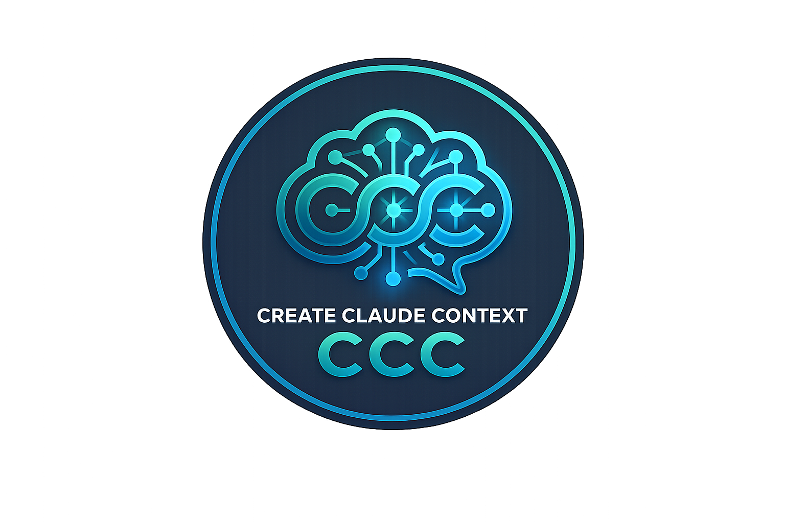

<p align="center">
  
</p>

# create-claude-context

A beautiful, interactive CLI tool to quickly bootstrap Claude-supported projects with essential context markdown files based on absolute best practices. By generating `.claudeprompt` and `CLAUDE.md` files natively, you make your project strictly bound to your exact structural blueprints.

## Why use this?
Manually writing rules and architecture context for Claude wastes time and ensures eventual architectural drift. This automated generator explicitly standardizes everything across your environments natively.

## Installation

This utility operates flawlessly via `npx`, bypassing the need to litter your global dependencies.

**Quick Start (Dynamic):**
```bash
npx create-claude-context
```

**Global Install:**
```bash
npm install -g create-claude-context
```

## CLI Commands

The utility is designed to be fully interactive, but supports standard terminal commands for inspecting the tool:

```bash
# Launch the interactive scaffolding wizard
create-claude-context

# Display the help menu and available flags
create-claude-context --help

# Output the current installed version
create-claude-context -V
create-claude-context --version
```

*(Note: When scaffolding the **Claude Code Workspace Ecosystem** tier, our engine dynamically injects custom Claude CLI commands into your repository, such as `/review` and `/test-all`, natively registering them in your `.claude/commands/` directory!)*

## Usage & Interactive Prompts

Running the CLI launches a sleek `@clack/prompts` interface. There are no confusing terminal flags to memorize; simply run the command and it visually guides you through orchestration:

1. **Project Name**: Defines the root directory.
2. **Target Architecture**: React/Next.js, Vue/Nuxt, Node.js (Backend), Python, or Vanilla. This optimally shapes the generated `CLAUDE.md`.
3. **Scaffolding Complexity**: The structural depth to inject (ranges from a single file to a complete enterprise workspace).
4. **General Guidelines Engine**: Triggers the generation of universal Anthropic interaction schemas.

## Scaffolding Tiers

The core power of this CLI lies in its ability to securely scaffold any complexity layer perfectly:

### 1. Basic Mode
Generates a singular concise `CLAUDE.md` architecture matrix.

### 2. Minimal Starter Set
A well-rounded baseline for small teams.
**Injects:**
- `CLAUDE.md`
- `README.md`
- `CONTEXT/`
- `PROMPTS/`
- `ARCHITECTURE.md` (inside CONTEXT)

### 3. Production Grade Engine
Designed to give Claude strict enterprise rules.
**Injects everything in Minimal, plus:**
- `SYSTEM_PROMPT.md`
- `GUARDRAILS.md`
- `DECISIONS.md`
- `FAQ.md`
- `TOOLS.md`
- `AGENTS.md`
- `GLOSSARY.md`

### 4. Portfolio AI
Specifically designed to create an AI representing your personal portfolio metrics.
**Injects everything in Production-Grade, plus:**
- `PROFILE_CONTEXT.md`
- `VISITOR_INTENT_MAP.md`
- `RESPONSE_POLICIES.md`

### 5. Claude Code Workspace Ecosystem
Natively duplicates Anthropic's brand new CLI structural parameters for agent tooling natively parsing `.mcp.json` context pipelines.
**Injects:**
- `.claude/settings.json` configuring `PreToolUse` and `PostToolUse` hooks linking linter mechanics.
- `.claude/commands/review.md` and `test-all.md` mapped string commands.
- `.claude/skills/code-review/SKILL.md` explicit skill bounds.
- `.mcp.json` proxy config bindings for Github and Postgres routing.
- Advanced `agents/code-reviewer.yml` topological subagent definitions.

## License

MIT
